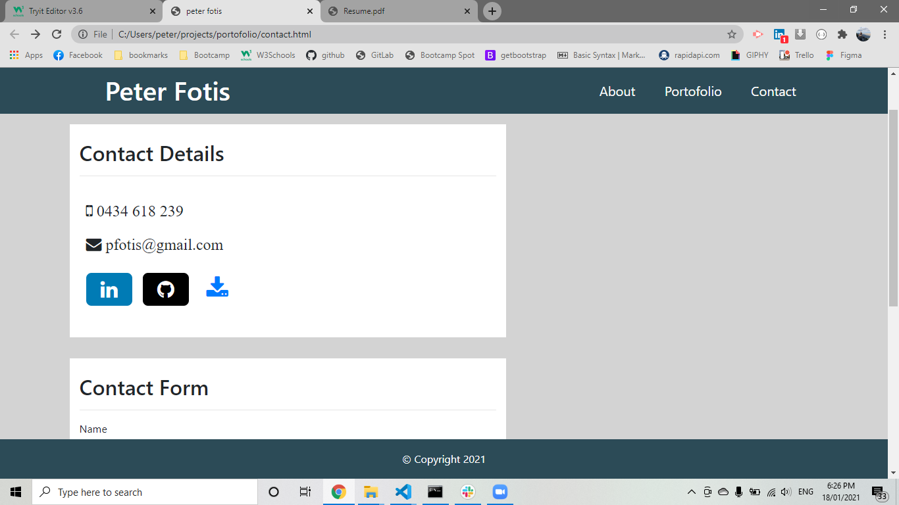
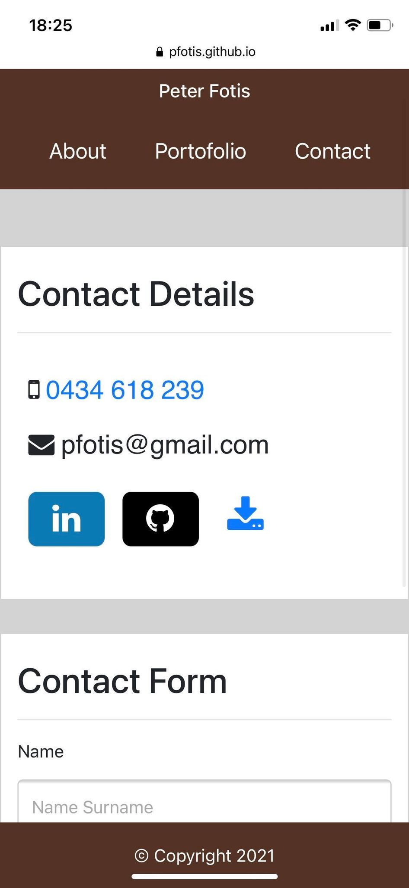

# Portofolio

link of repository :   https://github.com/pfotis/portofolio

link of webpage    :   https://pfotis.github.io/portofolio/

As full stack developer i built my portofolio in the github to include my projects with links for the webpage and the repository for each individual project. Information about me , my study in the bootcamp and the past and my Knowledgment in the coding. Finaly contact there are link of my github account and my linkedin acount , my personal email and mobile number additional link to download my resume.

The following images are from my portofolio desktop version and mobile version.

###  Desktop 

###  Mobile 

